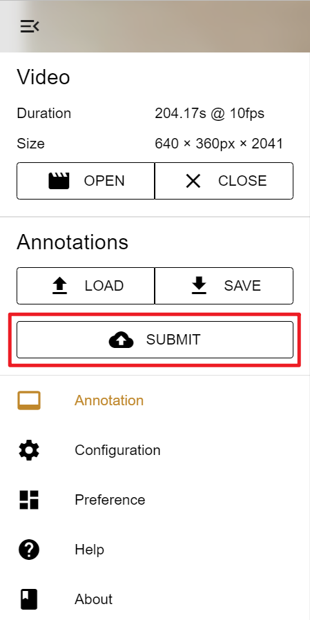

---
# Pandoc
title: MTurk Instruction - Admin
author: Jiahao Zhang
date: Mar. 5, 2022
documentclass: article
papersize: a4
geometry: margin=2.5cm
mainfont: Calibri
sansfont: Calibri
monofont: JetBrains Mono
fontsize: 11pt
listings: true
toc: true
linkcolor: Cyan
filecolor: Cyan
citecolor: Cyan
urlcolor: Cyan
# Eisvogel
titlepage: true
logo: img/davidz.png
header-right: Jiahao Zhang
toc-own-page: true
table-use-row-colors: false
listings-no-page-break: false
code-block-font-size: \normalsize
footer-left: "\\footerlogo"
header-includes:
  - |
    ```{=latex}
    \newcommand{\footerlogo}{\includegraphics[width=2cm]{img/anu.png}}
    ```
# Crossref
subfigGrid: true
autoSectionLabels: true
---

> Issues related to MTurk Management, please create issues [here](https://github.com/DavidZhang73/MTurkManagement/issues).
>
> Issues related to Vidat, please create issues [here](https://github.com/anucvml/vidat/issues).

# Log in MTurk Management

[MTurk Management](https://mturk.davidz.cn)

> User: `admin`
>
> Pass: `adminadmin`


# Load Tasks into a New Batch


> - `New Batch from JSON`: Make sure `DATASET_PATH` and `DATASET_JSON_NAME` are defined correctly in the `task/settings`.
> - `New Batch from MongoDB`: Deprecated.
> - `REVIEW` review the result in MTurk. This is available only after you have uploaded the batch to MTurk and have synced with MTurk in the Task tab. Make sure `MTURK_BATCH_REVIEW` is defined correctly in the `task/settings`.

# Get Task CSV


# Sign In MTurk Requester Sandbox

[MTurk Requester Sandbox](https://requestersandbox.mturk.com/signin_options)

# Start a New Project

> We will use the `Survey Link` template. Just follow the instruction.


.](img/step3-2.png)


# Publish Hits (Human Intelligence Tasks)


# Sync With MTurk

> This step is needed whenever a new batch is uploaded to MTurk.


# Audit Submissions


> STATUS:
>
> - `Created` annotation is submitted via Vidat
> - `Submitted` submission code is submitted via MTurk
> - `Approved` the assignment is approved
> - `Rejected` the assignment is rejected
> - `Unknown` unknown situation


> `Sync With MTurk` will iterate over all assignments with given HITIds in the Task tab. If the submission code (assignment id) and the HITId (task id) matches, the assignment will be marked as `Submitted`, or, it will be rejected automatically.
>
> E.g.
>
> - submission code is not in UUID format: rejected automatically
> - submission code is not for this task: rejected automatically
> - submission code could not be found: rejected automatically


> Some attributes could be helpful for audit
>
> - `#STEP` number of steps in this task, `#ANNOTATED STEP` number of annotated steps in this assignment, if `#ANNOTATED STEP` is significant less than `#STEP`, there could be some issues.
> - `Work Time` the time it takes the worker from accepting the HIT to submitting the HIT. If it is too short, then the quality of the annotation could be low.
> - `MTURK WORKER FEEDBACK` feedback from the worker.




# Delete a Batch


> All the foreignkeys are set to [CASCADED](https://docs.djangoproject.com/en/4.0/ref/models/fields/#django.db.models.ForeignKey.on_delete) on delete, therefore, whenever you delete a batch, all the related tasks are also removed, so is the assignment.


> Thanks for your cooperation, cheers!
