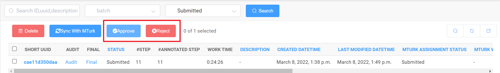

---
# Pandoc
title: MTurk Instruction - Admin
author: Jiahao Zhang
date: Mar. 1, 2022
documentclass: article
papersize: a4
geometry: margin=2.5cm
mainfont: Calibri
sansfont: Calibri
monofont: JetBrains Mono
fontsize: 11pt
listings: true
toc: true
linkcolor: Cyan
filecolor: Cyan
citecolor: Cyan
urlcolor: Cyan
# Eisvogel
titlepage: true
logo: img/davidz.png
header-right: Jiahao Zhang
toc-own-page: true
table-use-row-colors: false
listings-no-page-break: false
code-block-font-size: \normalsize
footer-left: "\\footerlogo"
header-includes:
  - |
    ```{=latex}
    \newcommand{\footerlogo}{\includegraphics[width=2cm]{img/anu.png}}
    ```
# Crossref
subfigGrid: true
autoSectionLabels: true
---

> Issues related to MTurk Management, please [email](mailto:u6921098@anu.edu.au) me directly.
>
> Issues related to Vidat, please create issue [here](https://github.com/anucvml/vidat/issues).

# Log In MTurk Management

[MTurk Management](https://mturk.davidz.cn)

> User: `admin`
>
> Pass: `adminadmin`


# Get Task CSV


# Sign In MTurk Requester Sandbox

[MTurk Requester Sandbox](https://requestersandbox.mturk.com/signin_options)

# Start A New Project

We will use the `Survey Link` template. Just follow the instruction.


.](img/step3-2.png)


# Publish Hits (Human Intelligence Tasks)


# Audit Submissions

> Each Submission corresponds to one audit entity. Audit is auto-generated when the submission is created by copying submission's annotation.




# Progress Status


All task progress status [WIP]

> Thanks for your cooperation, cheers!
