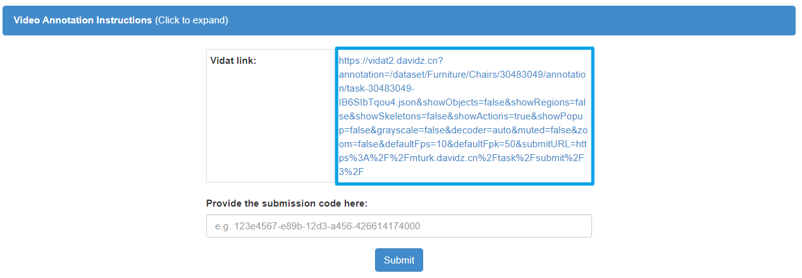
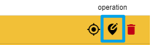
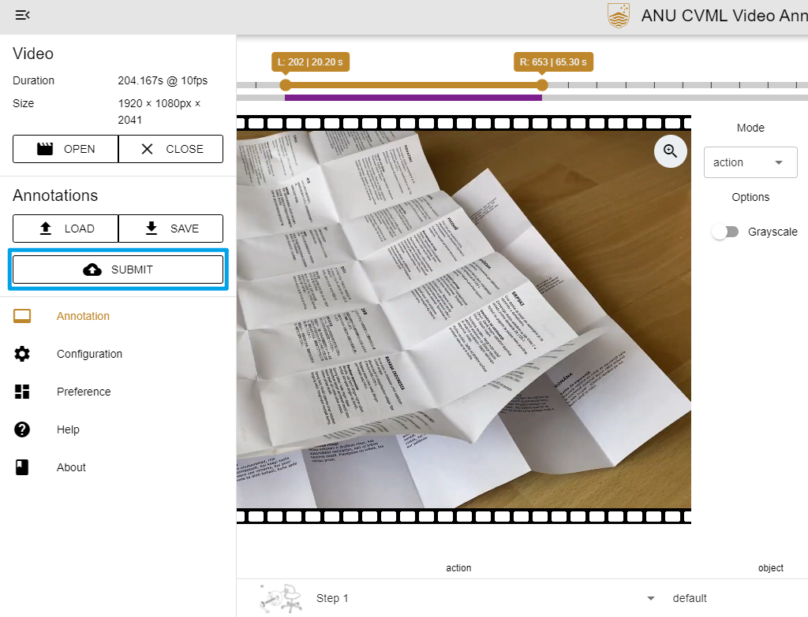
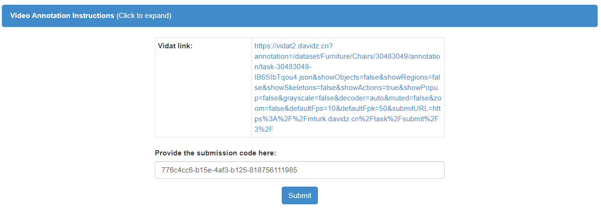

---
# Pandoc
title: MTurk Instruction - Admin
author: Jiahao Zhang
date: Mar. 1, 2022
documentclass: article
papersize: a4
geometry: margin=2.5cm
mainfont: Calibri
sansfont: Calibri
monofont: JetBrains Mono
fontsize: 11pt
listings: true
toc: true
linkcolor: Cyan
filecolor: Cyan
citecolor: Cyan
urlcolor: Cyan
# Eisvogel
titlepage: true
logo: img/davidz.png
header-right: Jiahao Zhang
toc-own-page: true
table-use-row-colors: false
listings-no-page-break: false
code-block-font-size: \normalsize
footer-left: "\\footerlogo"
header-includes:
  - |
    ```{=latex}
    \newcommand{\footerlogo}{\includegraphics[width=2cm]{img/anu.png}}
    ```
# Crossref
subfigGrid: true
autoSectionLabels: true
---

> Issues related to Vidat, please create issue [here](https://github.com/anucvml/vidat/issues).

# Sign In or Create an Account

[MTurk Worker Sandbox](https://workersandbox.mturk.com/)

You may be required to fill a registration form if you are the first time to use MTurk.


# Find Our Hit




# Annotation In Vidat

## Vidat


## Steps








# Submit In MTurk



> Thanks for your cooperation, cheers!
